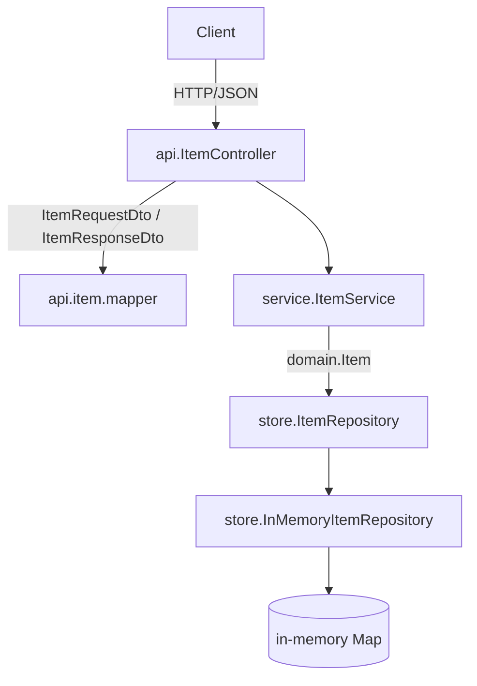

# Architecture

The service is a layered NestJS application. A request enters at the controller, which
speaks DTOs, and travels down through the service, which speaks the domain type, to an
in-memory store adapter, which speaks the repository port. Each layer depends only on the
layer below it.

## Layers

- `api/` holds the REST controller, the transport DTOs, the RFC 7807 problem detail DTO, and the mapper between DTOs and the domain. It carries the `@nestjs/swagger` annotations, so the OpenAPI document is generated from this code.
- `service/` holds the business logic. It works in `domain.Item` and depends on the `store.ItemRepository` port, not on the adapter.
- `domain/` holds `Item`, the type the service reasons about, and `ItemNotFoundException`. It has no framework imports.
- `store/` holds the domain-facing port and the in-memory adapter that implements it, along with the three dev seeds.
- `common/` holds `HttpExceptionFilter`, which maps `ItemNotFoundException` to an HTTP 404 problem detail.
- `openapi.ts` builds the OpenAPI document from the running application. `main.ts` wires the validation pipe, the filter, the Swagger UI, and the HTTP listener.

## Containment

The controller never sees a store record and the service never sees a DTO. The adapter is the
only place that writes to the `Map`, and the mapper is the only place that converts between
`Item` and the DTOs. That keeps the framework out of the domain and the business logic.
